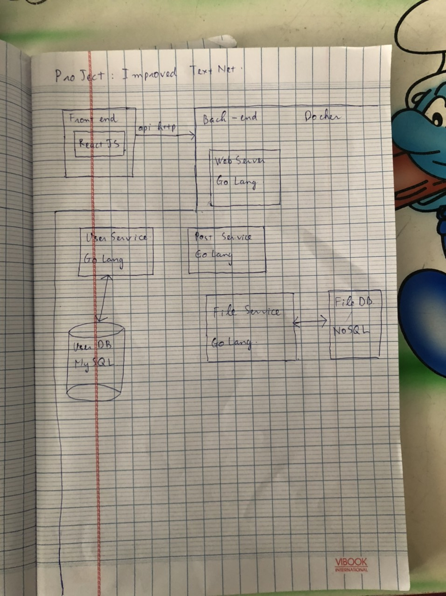
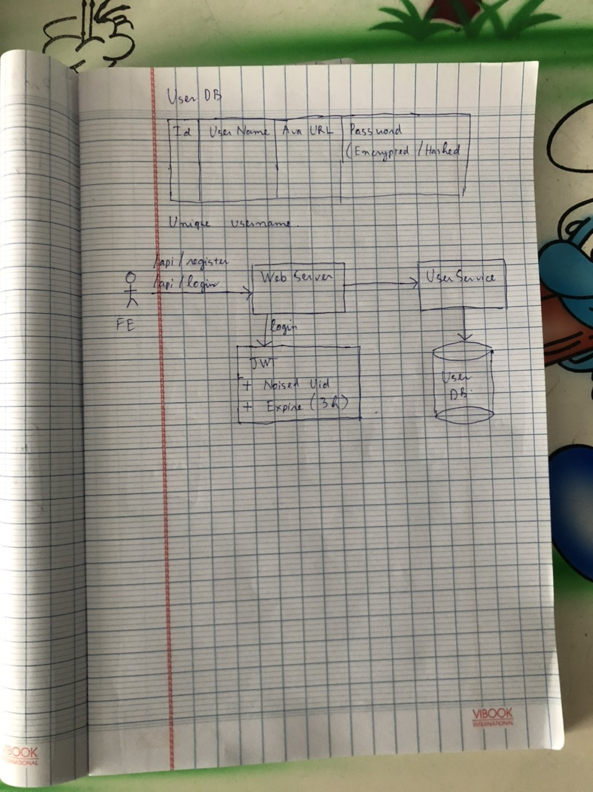

# ImprovedTextNet

## 1. Motivation
- This is an improved version of a project I used for probation in Zalo, VNG.
- This project doesnt contain any piece of code in the project in VNG. 
- I do this project because I want to see how better I am after 1 year in VNG

## 2. Functionalities  
### 2.1. Overall functionalities
- This project is a simple social network. You can make friends with other users, create post and share your ideas with them, and you can see what your friend are thinking about and interact with them.

## 3. Architectures
- This project is designed in microservice architecture
- My initial design:

### 3.1. Front end
- In my project in VNG, I used server side rendering, and the front end is only native HTML, CSS, JavaScript
- Now, I will use ReactJS for front end
- The reason why I change to ReactJS is performance. ReactJS has a good performance because it manipiulate VirtualDOM, not real DOM, so it gains better performance if front end change a little bit at a time. ReactJS only change modified parts in page, not change a whole page.
### 3.2. Back end
#### 3.2.1. UserService
- This service is responsible for managing user's information, including Id, UserName, Avatar, Password
- User's password will be hashed/encrypted
- In VNG, my project uses NoSQL to store user's information. Now, I use MySQL to do it. This change occurs because I want to utilize the unique constraints of MySQL.
- Initial design of UserService:

#### 3.2.2. WebServer
- This service handles API calls from Front End and uses JWT to identify user's token in cookies
- My project in VNG uses session key to identify users. The web server holds a map (session key --> (user's info, expire time)) in RAM. As request comes, it looks for session key in cookies and use that map to identify user. The drawback of this way is when the number of concurrent users increases, Server's RAM cannot hold all user's session key. 
- This project use JWT to authorize user. JWT token consists of 3 parts, seperated by a dot. The first part is metadata of JWT token, such as the token type or the algorithm we use to verify the token. The second part is all information we need to authorize user. In my case, I will put (noised user's id, expire time) in second part. The third part is used for verify the token. It is simply a concatenation of first part and second part hashed by an algorithm in the first part. In my case, I will use algorithm HMACSHA256 to produce the third part.

