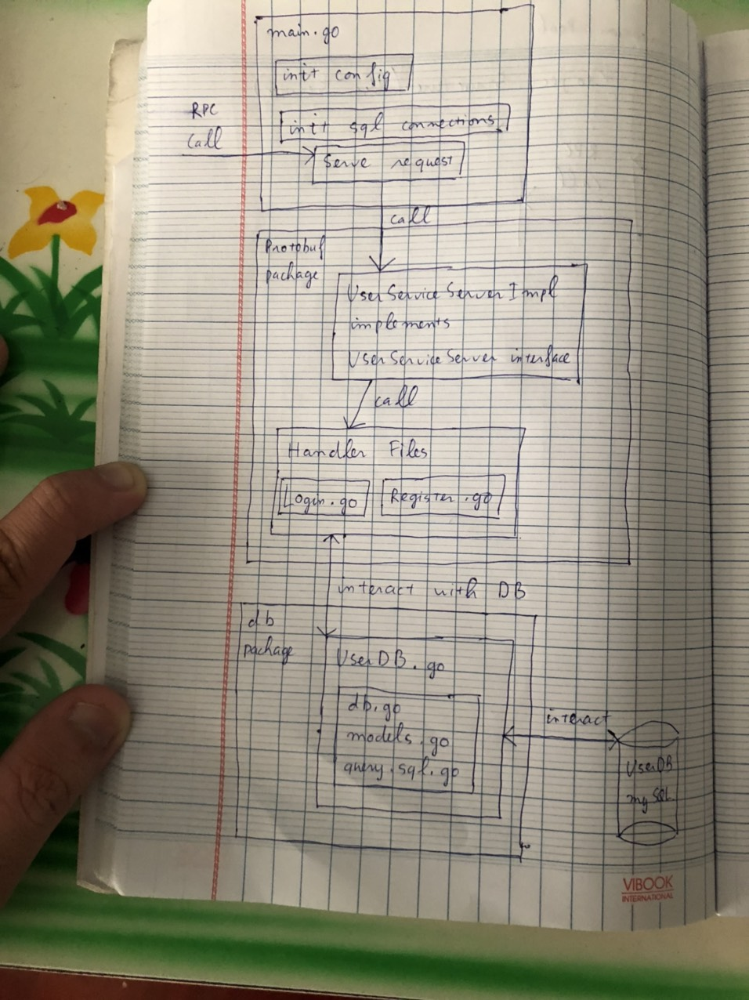

# USER SERVICE

## 1. Introduction
- This service is responsible for managing user's information

## 2. Service Architecture  
### 2.1. Configuration
- I use Viper to read configuration file 
### 2.2. Project Structure  
#### 2.2.1. config folder 
- Contains config files  
#### 2.2.2. db folder 
- Interacting with UserDB (MySQL)  
#### 2.2.3. protobuf
- Generating interfaces and implementing handler codes for UserService  
#### 2.2.4. utils
- Utility functions, helper functions  
### 2.3. Project Workflow
- This project will handle RPC requests relating to user's information of another services
- The following picture shows how project handles an RPC call
- 
### 2.4. Project's DB
#### 2.4.1. Design DB to store user information
- User's information is stored in table "users", UserDB database.
- Table "user" initialy has 4 columns: 
    > UserId: int32, AutoIncrement  
    > Username: nvarchar(50), unique  
    > Avatar: nvarchar(100)  
    > Password: nvarchar(100)  
- Primary key of "user" is "UserId"
#### 2.4.2. Design DB to store relationships between users
- I think there are 2 good ways to store information about relationships between users.

- The first way is using MySQL to store relationships. I create a table named "relationships" in databse "UserDB" with 3 columns: IdFrom is a source user, IdTo is a destination user and relationship that source user has with destination user. for example, if IdFrom = 1, IdTo = 2 and RelationshipType = follow, it means that user 1 is following user 2. The primary key is (IdFrom, IdTo) because IdFrom cannot have more than 1 relationship with IdTo (user 1 cannot be following and blocking user 2 at the same time). I create 2 more index because I want to solve 2 types of query quickly. Type 1: find all users following user 1. Type 2: find all users that user 1 is following. 
- The second way is using GraphQL database to store relationships between users. The reason why I consider this way is it is the natural way to represent relationships. I will learn and apply this way in phrase 2 of the project.  

## 3. Service API
### 3.1. Register
- See protobuf/Register.go
- Register a new account
- Input: Username, Password
- Output: Error if an error occurs, otherwise return empty message
- Note:  
    > Username and password's length must be in range [8, 50]. 
    > Username is unique.  
    > Password is hashed (see utils/Encrypt.go)

### 3.2 Login
- See protobuf/Login.go
- Handle request login account
- Input: Username, Password
- Output:  
    > Error if error occurs  
    > Otherwise return user's information: Username, UserId, Avatar.  

